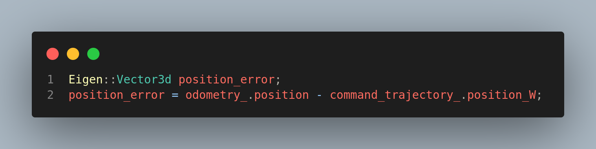

# Controller Problem

```bash
[ INFO] [1691759262.929574264, 739.627000000]: 0.367363 0.000000 -0.258914
[ INFO] [1691759262.929818219, 739.627000000]: 0.367363 0.000000 -0.258914
[ INFO] [1691759262.931006080, 739.628000000]: 0.367363 0.000000 -0.258914
[ INFO] [1691759262.974300270, 739.636000000]: 0.367363 0.000000 -0.258914
[ INFO] [1691759262.974702835, 739.636000000]: 0.367363 0.000000 -0.258914
```

The above is error output in delx, dely, delz
This turns out to be a persistent bias. Note that this has been printed from
`./pud_control/src/library/lee_position_controller.cpp`


> Acceleration readings:

```bash
[ INFO] [1691769322.083675521, 1051.341000000]: 1.450118 -0.000000 -10.832030
[ INFO] [1691769322.084438188, 1051.342000000]: 1.450118 -0.000000 -10.832030
[ INFO] [1691769322.102628628, 1051.360000000]: 1.450118 -0.000000 -10.832030
[ INFO] [1691769322.102834869, 1051.360000000]: 1.450118 -0.000000 -10.832030
[ INFO] [1691769322.103460927, 1051.361000000]: 1.450118 -0.000000 -10.832030
```
